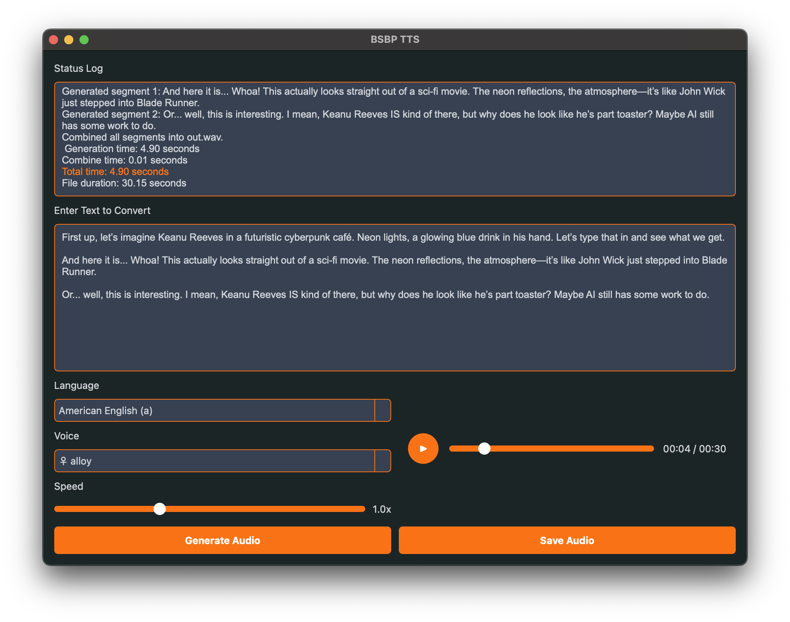

```markdown
# BSBP TTS - Text-to-Speech Application

BSBP TTS is a desktop application built with PyQt6 and the Kokoro TTS library, designed to convert text into high-quality audio using various voices and languages. It features an intuitive GUI with real-time audio playback, customizable speed, and a sleek, modern design.

## Features
- **Multi-Language Support**: Supports American English, British English, Spanish, French, Hindi, Italian, Japanese, Brazilian Portuguese, and Mandarin Chinese.
- **Voice Selection**: Choose from a variety of male and female voices for each language.
- **Speed Control**: Adjust playback speed from 0.5x to 2.0x using a slider.
- **Audio Playback**: Built-in media player with play/pause, seek functionality, and time display.
- **Status Logging**: Real-time logs of generation progress and errors.
- **Loading Indicator**: Circular progress animation during audio generation.
- **Save Audio**: Export generated audio as WAV files with timestamped filenames.
- **Customizable UI**: Modern dark theme with orange accents, powered by PyQt6 stylesheets.

## Prerequisites
- Python 3.8+
- PyQt6 (`pip install PyQt6`)
- Kokoro TTS (`pip install kokoro>=0.9.2`)
- Soundfile (`pip install soundfile`)
- PyTorch (`pip install torch`)
- NumPy (`pip install numpy`)

## Installation
1. Clone this repository:
   ```bash
   git clone https://github.com/kisharora/bsbpaudioai.git
   cd bsbp-tts
   ```
2. Install the required dependencies:
   ```bash
   pip install -r requirements.txt
   ```
3. (Optional) Place a `logo.jpg` file in the root directory to set a custom app icon.

## Usage
1. Run the application:
   ```bash
   python app.py
   ```
2. Enter text in the text box.
3. Select a language and voice from the dropdown menus.
4. Adjust the speed using the slider (default is 1.0x).
5. Click "Generate Audio" to create the audio file.
6. Use the built-in player to preview the audio or click "Save Audio" to export it as a WAV file.

## File Structure
```
bsbpaudioai/
│
├── build/               # Build directory (ignored in .gitignore)
├── dist/                # Distribution directory (ignored in .gitignore)
├── venv/                # Virtual environment (ignored in .gitignore)
├── .gitignore           # Git ignore file
├── app.py               # Main application entry point
├── app.spec             # PyInstaller spec file (ignored in .gitignore)
├── bsbp_tts_kokoro.py   # Main application code using Kokoro TTS
├── bsbp_tts_orpheus.py  # Alternative TTS implementation with Orpheus
├── logo.icns            # App icon for macOS
├── logo.jpg             # App icon
├── out.wav              # Generated audio file (ignored in .gitignore)
├── README.md            # This file
├── requirements.txt     # List of dependencies
├── screenshots/         # Directory for application screenshots
│   └── gui.png          # Screenshot of the application GUI
├── tts.spec             # Another PyInstaller spec file (ignored in .gitignore)
```

## Screenshots


## Technical Details
- **Framework**: PyQt6 for the GUI.
- **TTS Engine**: Kokoro TTS (`hexgrad/Kokoro-82M`) for audio generation.
- **Audio Processing**: Multi-threaded audio generation with progress updates.
- **UI Components**:
  - Custom `CircularProgressIndicator` for loading animations.
  - `VoiceDelegate` for styled voice dropdowns.
  - QMediaPlayer for audio playback with seek functionality.
- **Output**: Audio saved as `out.wav` at 22.05 kHz for compatibility.

## Orpheus Integration (Optional)
The repository includes an alternative script (`bsbp_tts_orpheus.py`) for using the Orpheus TTS model. To use it:
1. Install the additional dependencies for Orpheus:
   ```bash
   pip install orpheus-speech vllm torch
   ```
2. Run the Orpheus version of the application:
   ```bash
   python bsbp_tts_orpheus.py
   ```

## Troubleshooting
- **"Error: Please install the required dependencies"**: Ensure all packages are installed (`kokoro`, `soundfile`, `torch`).
- **Pipeline Initialization Fails**: Check your internet connection (required for downloading Kokoro models) or verify the `lang_code`.
- **No Audio Generated**: Verify the input text is not empty and the selected voice matches the language.

## Contributing
Contributions are welcome! Please submit a pull request or open an issue for bugs, feature requests, or improvements.

## License
This project is licensed under the MIT License - see the [LICENSE](LICENSE) file for details.

## Acknowledgments
- [Kokoro TTS](https://github.com/hexgrad/kokoro) for the TTS engine.
- [PyQt6](https://www.riverbankcomputing.com/software/pyqt/) for the GUI framework.
- xAI for inspiration (just kidding, unless...?)
```

### Step 3: Explanation of Changes
1. **File Structure**:
   - Updated the "File Structure" section to reflect the actual directory shown in the image, including `build/`, `dist/`, `venv/`, `.gitignore`, `app.py`, `app.spec`, `logo.icns`, `tts.spec`, and the new `screenshots/` directory.
   - Noted that some files/folders (e.g., `build/`, `dist/`, `venv/`, `out.wav`, `*.spec`) are ignored in the `.gitignore` file, as per the `.gitignore` content.

2. **Screenshots Section**:
   - Added a screenshot link using Markdown syntax: ``. This assumes the screenshot is named `gui.png` and placed in the `screenshots/` folder.
   - If you name your screenshot differently or place it elsewhere, adjust the path accordingly (e.g., ``).

3. **Orpheus Integration**:
   - Updated the "Orpheus Integration" section with specific instructions based on the `bsbp_tts_orpheus.py` script, including the required dependencies (`orpheus-speech`, `vllm`, `torch`) and the command to run the script.

4. **Other Notes**:
   - The repository URL in the "Installation" section remains `https://github.com/kisharora/bsbpaudioai.git` as per the original `README.md`. If this is not your actual repository URL, replace it with the correct one.
   - The "License" section assumes a `LICENSE` file exists. If it doesn't, you can remove this section or create a `LICENSE` file with the MIT License text.

### Step 4: Save the Updated `README.md`
- Replace the content of your existing `README.md` file in the `BSBPAUDIOAI` directory with the updated content above.
- Ensure the `screenshots/gui.png` file exists in the specified location, or adjust the path in the `README.md` to match the actual location of your screenshot.

### Step 5: Verify the Changes
- Open the `README.md` file in a Markdown viewer (e.g., on GitHub or using a local Markdown renderer) to ensure the screenshot displays correctly and the file structure matches your project.
- If the screenshot doesn't display, double-check the file path and ensure the image file is in the correct location.

Let me know if you need help taking a screenshot of the application GUI or if you have additional screenshots to include!